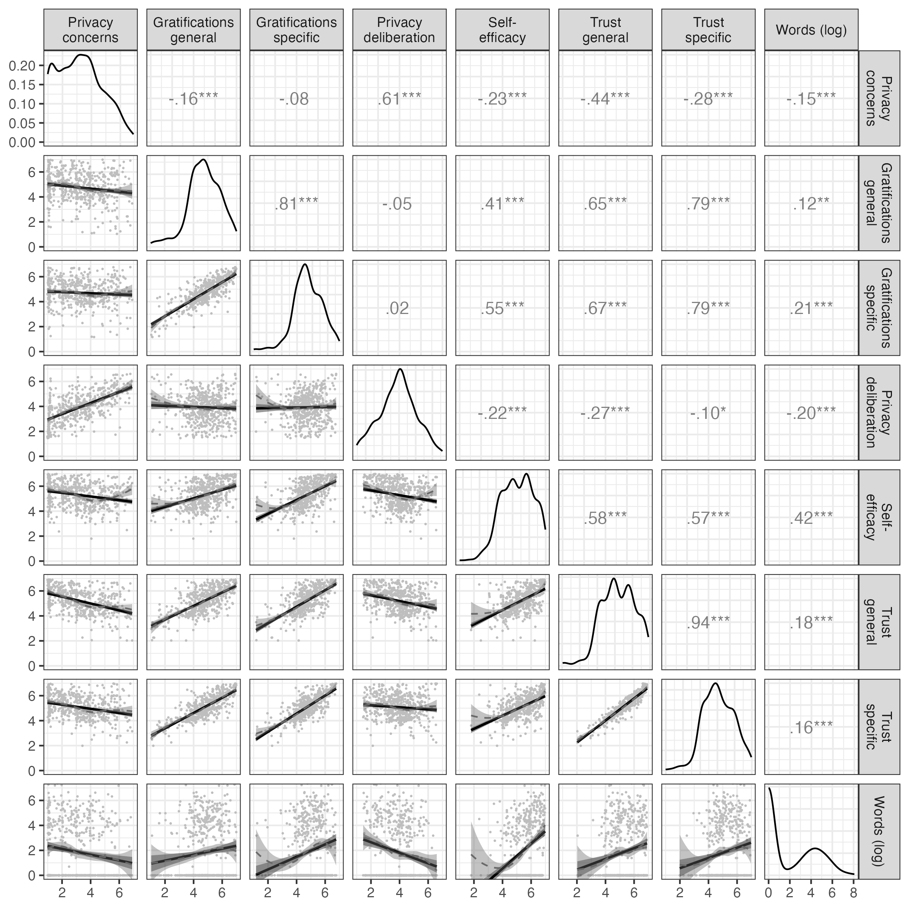
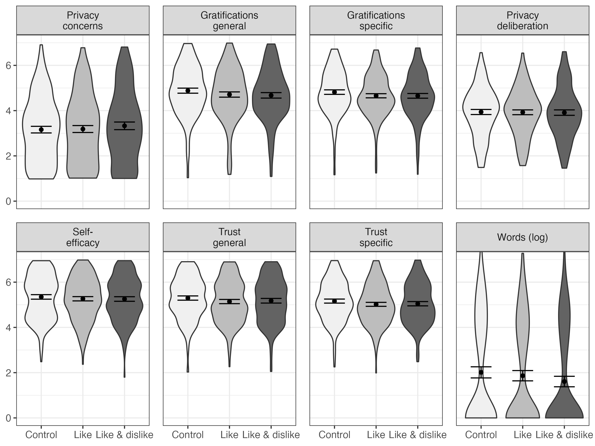
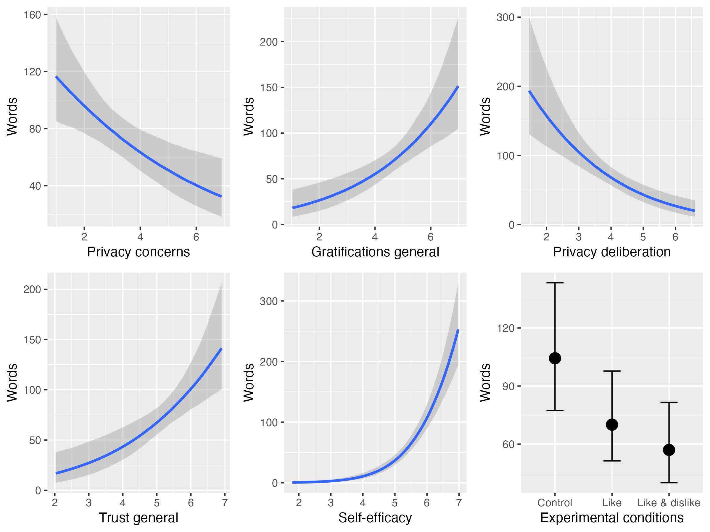

```{r include=F}
knitr::opts_chunk$set(
  cache=F, 
  echo=F, 
  warning=F, 
  message=F
  )
options(
  digits = 2
)
```

```{r setup, include=F}
# install github packages
# devtools::install_github("tdienlin/td@v.0.0.2.3")

# load packages
pcks <- c(
  "devtools", 
  "english",
  "jpeg", 
  "knitr", 
  "lavaan", 
  "magrittr", 
  "papaja", 
  "png", 
  "pwr", 
  "semTools", 
  "td", 
  "tidyverse"
  )

invisible(
  lapply(
    pcks 
    # , install.packages
    , library
    , character.only = TRUE
    )
  )

# create bib with r-packages
r_refs(file = "bibliography/r-references.bib")

# load bib
r_citations <- 
  cite_r(
    "bibliography/r-references.bib"
    , footnote = FALSE
    , withhold = FALSE
    , pkgs = c(
      "brms"
      , "tidyverse"
      , "lavaan"
      , "marginaleffects"
      , "papaja" 
      , "pwr"
      , "quanteda"
      , "semTools"
      )
    )
```

```{r load-data, cache=F, include=F}
load("data/workspace.rData")
```

# Introduction

According to the privacy paradox, the way users share information online is erratic [@barnesPrivacyParadoxSocial2006]:
Although being strongly concerned about their privacy, people communicate much personal information online  [@taddickenUsesPrivacyOnline2011].
However, despite its popularity in both academic research [@masurUnderstandingEffectsConceptual2023] and the public press [@newyorkpublicradioPrivacyParadox2018], empirical support for the privacy paradox is tenuous [@baruhOnlinePrivacyConcerns2017]. 
Research is increasingly building on the privacy calculus model [@dienlinPrivacyCalculusTheories2023], which states that communication online can be explained by perceived risks and expected benefits [@bolUnderstandingEffectsPersonalization2018; @krasnovaOnlineSocialNetworks2010].

Although the privacy calculus has gained momentum in academic research, several important questions remain unanswered. 
First, the privacy calculus' empirical foundation needs to be improved [@knijnenburgDeathPrivacyCalculus2017]. 
To date, much research on the privacy calculus builds on (a) self-reports of behavior [@krasnovaOnlineSocialNetworks2010], (b) vignette approaches [@bolUnderstandingEffectsPersonalization2018], or (c) one-shot experiments in the lab [@treptePrivacyCalculusContextualized2020]. 
Self-reports are often unreliable measures of online behavior [@parrySystematicReviewMetaanalysis2021], vignette approaches have limited external validity, and one-shot experiments cannot analyze effects of sustained use.
The first aim is therefore to replicate the privacy calculus model in a more authentic and long-term setting using actual behavioral data.
Doing so will show its robustness, and it will help understand if behavior is better explained by the privacy paradox approach or by the privacy calculus model.

Second, the privacy calculus model is criticized for neglecting the actual process of weighing pros and cons, and for over-emphasizing rationality  [@knijnenburgDeathPrivacyCalculus2017].
According to critics, simply showing that both concerns and gratifications correlate with communication online does not prove that an explicit weighing process took place.
Instead, we would need to find out if people deliberately compare costs and benefits before communicating online. 
Therefore, I will also analyze the process of comparing pros and cons explicitly, by elaborating on what I will call the the privacy deliberation process [@omarzuDisclosureDecisionModel2000]. 
Next, focusing exclusively on costs and benefits might not fully capture how and why users engage online.
I, hence, extend the privacy calculus by analyzing how online communication is affected by trust and self-efficacy, two variables less focused on rationality and more oriented toward socio-psychological aspects critical in online contexts [@metzgerPrivacyTrustDisclosure2004].

Online behavior is determined by the person itself and their external circumstances [@bazarovaIntegrationIndividualisticNetworked2020; @treptePrivacyCalculusContextualized2020; @spottswoodShouldShareThat2017].
The privacy calculus upholds that much of behavior is rational and self-determined, but how strongly does this process depend on online affordances?
It is well known that the affordances of many online services are optimized to elicit as much interaction as possible [@ellisonSocialNetworkSite2015; @masurBehavioralContagionSocial2021], for example via low threshold communication features such as likes, shares, replies, or reactions  [@carrPredictingThresholdPerceived2018]. 
Implicit and explicit cues on how a website is used can increase communication [@spottswoodShouldShareThat2017; @treptePrivacyCalculusContextualized2020].
How large are the effects of external popularity cues such as like and dislike buttons compared to the internal weighing of pros and cons?
And how easily can the mechanisms of the privacy calculus be affected by means of popularity cues?

In conclusion, in this paper we contribute to communication theory by means of (a) replication, (b) falsification, (c) extending the range of existing theory, (d) elucidating mechanisms, and (e) theory comparison [@deandreaIncreasingClarityWhere2017].

## Replicating the Privacy Calculus

The privacy calculus analyzes why people communicate online.
When are we willing to engage in a conversation?
It builds on the calculus of behavior [@lauferPrivacyConceptSocial1977] and states that people are weighing risks and benefits before actively communicating.
Communication is closely related to privacy, which is defined as a "voluntary and temporary withdrawal of a person from the general society" [@westinPrivacyFreedom1967, p. 7].
People regulate their privacy by deciding what and what not to communicate [@dienlinPrivacyProcessModel2014].
Communication is therefore also closely related to self-disclosure.
Just as it is impossible to not communicate, communication inherently promotes self-disclosure. 
In a recent study, communication quantity and the frequency of expressing one's political opinion was almost indistinguishable (_r_ = .91; AUTHORS).
Next to breadth and depth, communication quantity is hence often considered a central dimension of self-disclosure [@omarzuDisclosureDecisionModel2000].

Sharing information carries risks, as recipients may reuse it in different contexts, potentially harming the original sender [@masurBehavioralContagionSocial2021].
As a result, people who aim to avoid risks should be inclined to share less information, especially in online contexts where audiences are much larger [@vitakImpactContextCollapse2012].
Indeed, empirical research confirms that people with higher privacy needs and privacy concerns are less likely to communicate online [@krasnovaOnlineSocialNetworks2010; @masurTransformativeNotHow2021; @masurUnderstandingEffectsConceptual2023].
This finding is now confirmed by several meta-analyses and reviews [@baruhOnlinePrivacyConcerns2017; @dienlinDoesPrivacyParadox2021; @gerberExplainingPrivacyParadox2018].
Similarly, people who are more concerned about their privacy also engage in more privacy protection behaviors [@baruhOnlinePrivacyConcerns2017; @stubenvollLivingEasyEyes2022].

Even outweighing concerns, the most relevant drivers of online communication are expected gratifications [@dienlinExtendedPrivacyCalculus2016; @bolUnderstandingEffectsPersonalization2018; @kezerGettingPrivacyCalculus2022].
On average, people are happy to trade in parts of their privacy to receive something more valuable in return [@lauferPrivacyConceptSocial1977].
In online communication, the most important benefits include social support, social capital, entertainment, information-seeking, and self-presentation [@dhirUnderstandingRelationshipIntensity2017; @ellisonBenefitsFacebookFriends2007; @krasnovaOnlineSocialNetworks2010; @whitingWhyPeopleUse2013].

H1: People who are more concerned about their privacy are less likely to communicate actively on a website.

H2: People who obtain more gratifications from using a website are more likely to communicate actively on a website.

## Extending the Privacy Calculus

Although privacy calculus implies that people explicitly compare benefits and risks before communicating online, prior research has neglected this aspect [@knijnenburgDeathPrivacyCalculus2017].
Only observing that privacy concerns or expected gratifications and communication online are related does not prove that an explicit weighing process took place [@knijnenburgDeathPrivacyCalculus2017]. 
Instead, we need to analyze if, and if so by how much, people actively deliberate about their privacy by comparing benefits and risks, and whether doing so influences their willingness to communicate.
Self-disclosure theory [@omarzuDisclosureDecisionModel2000;  @altmanPrivacyConceptualAnalysis1976] suggests that if the benefits of communication are attractive, deciding whether or not to communicate is a "conscious and deliberative process"  [@omarzuDisclosureDecisionModel2000, p. 183].
I hence introduce and investigate a novel concept termed _privacy deliberation_.
Privacy deliberation captures the extent to which individuals explicitly compare risks and benefits before communicating with others.

How could deliberating about one's privacy affect communication?
On the one hand, it could reduce subsequent communication.
Refraining from communication---the primary means of connecting with others [@altmanPrivacyConceptualAnalysis1976]---often requires restraint [@omarzuDisclosureDecisionModel2000]. 
This is especially true for social media, which are designed to foster communication and participation [@ellisonSocialNetworkSite2015; @masurBehavioralContagionSocial2021].
Actively thinking about whether communicating is worthwhile might be the first step not to participate.
In addition, actively reflecting about one's behavior represents a central and Type 2 approach toward decision making, which is often associated with more critical and cautious behavior [@kahnemanThinkingFastSlow2011; @pettyCommunicationPersuasionCentral1986].

On the other hand, deliberating about privacy might also increase communication. 
The default behavior in online contexts is passively browsing the content, but not actively engaging in communication [@ozimekActivePassiveBehavior2023]. 
Especially in new contexts without prior experience, actively pondering one's options might trigger users to leave their default state of passiveness and to become active and involved.
In light of the numerous benefits mentioned above, it might make sense to conclude that participation is beneficial, thereby fostering communication [@krasnovaOnlineSocialNetworks2010].

RQ1: Do people who deliberate more actively about their privacy communicate more or less online?

<!-- The aforementioned weighing process is not flawless or perfect. -->
It is useful to understand the privacy calculus from the perspective of _bounded rationality_ [@simonBoundedRationality1990].
Bounded rationality states that "(1) humans are cognitively constrained; (2) these constraints impact decision making; and (3) difficult problems reveal the constraints and highlight their significance." [@bendorBoundedRationality2015, p. 1303].
It is important to emphasize that although human behavior is considered _partly_ irrational, bounded rationality does not state that it is _completely_ irrational [@gigerenzerBoundedRationalityAdaptive2002].
Instead, rationality needs to be understood as a continuum. 
And in the context of online privacy, rationality is impeded by information asymmetries, presence bias, intangibility, illusory control, or herding [@acquistiSecretsLikesDrive2020].
It follows that to provide a more complete picture, additional factors less focused on rationality but more on socio-psychological aspects should also explain communication.

Two central factors that help us understand online communication are self-efficacy and trust [@hossainICTEnabledVirtual2004; @metzgerPrivacyTrustDisclosure2004].
Privacy violations create psychological distress [@ledbetterParentchildPrivacyBoundary2019].
Experiencing online contexts as a safe space that users can sufficiently control is important for engaging in online communication. 
If users are more familiar, experienced, and knowledgeable in a given online context, they are more likely to navigate that online contexts successfully and to communicate actively [@baruhOnlinePrivacyConcerns2017; @kramerMasteringChallengeBalancing2020; @parkDigitalLiteracyPrivacy2013a].
People with more privacy self-efficacy engage more successfully in self-withdrawal [@dienlinExtendedPrivacyCalculus2016] and protective online behavior [@boermanExploringMotivationsOnline2021a; @vanooijenPrivacyCynicismIts2022].
Hence, if users possess more self-efficacy to participate, they should also communicate more.

H3: People are more likely to communicate on a website when their self-efficacy to actively use the website is higher.

In all situations where people lack experience, control, or competence, a central variable to understand behavior is trust [@gefenTrustTAMOnline2003].
Trust plays a key role especially in online contexts [@metzgerPrivacyTrustDisclosure2004; @metzgerEffectsSiteVendor2006a].
Users often cannot control the environment or the way their information is handled [@acquistiSecretsLikesDrive2020; @braunlichLinkingLooseEnds2020].
Trust either captures "_specific_ beliefs dealing primarily with the integrity, benevolence, and ability of another party" [@gefenTrustTAMOnline2003, p. 55, emphasis added] or a "_general_ belief that another party can be trusted" [@gefenTrustTAMOnline2003, p.55, emphasis added]. 
In online contexts, there are different targets of trust, including (a) the information system, (b) the provider, (c) the Internet, and (d) the community of other users [@sollnerWhyDifferentTrust2016]. 
People who put more trust in the providers of networks, for example, disclose more personal information [@liEmpiricalStudiesOnline2011]. 
To comprehensively capture and understand online communication, trust should hence be included.

H4: People are more likely to communicate on a website when they have greater trust in the provider, the website, and the other users.

## Analyzing the Impact of Popularity Cues

How are the privacy calculus and communication affected by the context, the digital infrastructure? 
How easily can the calculus be manipulated externally?
One of the central tools to afford and govern online behavior are popularity cues such as like and dislike buttons [@stsiampkouskayaNotExperimentalStudy2023].
Popularity cues have been shown to affect behavior [@kramerMasteringChallengeBalancing2020; @masurBehavioralContagionSocial2021; @treptePrivacyCalculusContextualized2020].
For example, online comments that already have several dislikes are more likely to receive further dislikes [@muchnikSocialInfluenceBias2013]. 
When users disagree with a post, they are more likely to click on a button labeled _respect_ compared to a button labeled _like_ [@stroudRecommendRespectAltering2017].

How and why might popularity cues affect the privacy calculus?
In analyzing this question, it makes sense to analyze the cues' underlying affordances [@ellisonSocialNetworkSite2015; @foxDistinguishingTechnologiesSocial2017].
Affordances are mental representations of how objects might be used.
They emphasize that it is not the _objective features_ that determine behavior, but rather our _subjective perceptions_ [@gibsonEcologicalApproachVisual2015].
Popularity cues such as like and dislike buttons, which are of primary interest in this study, are understood as "paralinguistic digital affordances" [@carrPredictingThresholdPerceived2018, p. 142], lowering thresholds to partake in online communication.

Popularity cues likely impact the privacy calculus via two underlying theoretical mechanisms [@kramerMasteringChallengeBalancing2020]:
First, the _mere presence_ of popularity cues might affect whether people are willing to disclose. 
Being able to attract likes might afford active communication. 
The mere option to receive dislikes, conversely, might inhibit communication.
Second, _actually receiving_ likes or dislikes might affect behavior, by means of positive reinforcement (likes) or punishment (dislikes) [@skinnerScienceHumanBehavior2014].
To illustrate, likes are affirmative and embody the positivity bias of social media [@schreursExposurePositivityBias2022]. 
Receiving a like online is similar to receiving a compliment offline [@carrPredictingThresholdPerceived2018; @sumnerFunctionalApproachFacebook2017].
Like buttons afford and emphasize a _gain frame_ [@rosoffHeuristicsBiasesCyber2013].
These gains can be garnered only through active participation. 
In situations where people can gain immediate positive outcomes, concerns and risks that are more vague and in the future often become less relevant [presence bias, @ainslieHyperbolicDiscounting1992].
Because like buttons emphasize positive outcomes, it is likely that concerns decrease. 
In situations where there is more to win, people might also more actively deliberate about whether or not to communicate. 

Dislikes, instead, represent a punishment, introducing a _loss frame_. 
Websites featuring both like _and_ dislike buttons should therefore be more ambivalent compared to websites without popularity cues, fostering privacy deliberation.
Privacy concerns should not be reduced anymore:
People who need more privacy are also more shy and risk averse [@dienlinWhoNeedsPrivacy2024].
Implementing the dislike button might therefore increase privacy concerns, canceling out the positive effects of the like button.
At the same time, communication and benefits might still be increased compared to a website without like and dislikes buttons, as online benefits are often considered to outweigh risks [positivity bias, @schreursExposurePositivityBias2022].

H5.	Compared to a control group with no like and dislike buttons, people who use a website with like buttons (a) communicate more; (b) obtain more gratifications; (c) are less concerned about their privacy; and (d) deliberate more about whether they should communicate online.

H6.	Compared to a control group with no like and dislike buttons, people who use a website with like _and_ dislike buttons (a) communicate more; (b) obtain more gratifications; and (c) deliberate more about whether they should communicate online.

H7.	Compared to people who use a website with only like buttons, people who use a website with like and dislike buttons (a) are more concerned about their privacy, and (b) deliberate more about whether they should communicate online.

In conclusion, this leads to an updated and extended model of the privacy calculus, in which the affordances of online contexts affect communication mediated via experienced privacy concerns, expected gratifications, privacy deliberation, self-efficacy, and trust. For an overview of the theoretical model, see Figure \@ref(fig:model).

```{r model, fig.cap="Overview of the extended privacy calculus model.", fig.align='center', out.width=".8\\textwidth"}
# knitr::include_graphics("figures/design/model_simplified.pdf")
knitr::include_graphics("figures/design/model_simplified.png")
```

# Methods
## Open Science

This manuscript features a [companion website](https://XMtRa.github.io/like_dislike), which includes the data, research materials, analysis scripts, and a reproducible version of this manuscript (see https://XMtRa.github.io/like_dislike).
The hypotheses, sample size, research materials, analyses, and exclusion criteria were preregistered (see https://osf.io/a6tzc/?view_only=5d0ef9fe5e1745878cd1b19273cdf859). 
In some cases, the preregistered approach had to be changed (see [companion website](https://XMtRa.github.io/like_dislike/preregistration_changes)). 
Analyses not preregistered are reported as exploratory analyses.

## Procedure

The study was designed as an online field experiment with three different groups. 
The first experimental group used a website that included like buttons; the second experimental group used an identical website including both like and dislike buttons; and the control group used an identical website without like and dislike buttons. 
Participants were randomly distributed to one of the three websites in a between-subject design.

The data were collected in Germany.
Participants were recruited using the professional panel agency Norstat.
As incentive, participants were awarded digital points, to receive special offers from online retailers. 
Participants had to be over 18 years old and reside in Germany.
In a first step, the company sent its panel members an invitation to participate in the study. 
In this invitation, panel members were asked to participate in a study analyzing the current threat posed by terrorist attacks.
Members who agreed to participate were sent the first questionnaire (_T1_).
The questionnaire asked participants about their sociodemographic background, (b) provided more details about the study, and (c) included a registration link for the website, which was introduced as "participation platform".
Afterward, participants were randomly assigned to one of the three websites. 
After registration was completed, participants were invited (but not obliged) to visit the website and to discuss the topic of the terrorism threat in Germany. 
Participants could use the website and write comments over the course of one week.
Subsequently, participants received a follow-up questionnaire in which the self-reported measures reported below were collected (_T2_). 

```{r website, echo=FALSE, out.width="49%", fig.cap="Screenshot of the landing page and of communication taking place. Translated into English.", fig.show='hold', fig.align='center'}
knitr::include_graphics(c("figures/website/website_translated.png","figures/website/comments_translated.png"))
``` 

The online website was programmed based on the open-source software _discourse_ (https://www.discourse.org/). 
To make sure the website was professional and authentic, several pretests with students from the local university were run.
`r n_users %>% english::english() %>% str_to_sentence` participants created a user account on the website (see below) and used the website actively. 
Overall, they spent `r sum(d_raw$time_read, na.rm = TRUE) %>% "/"(3600) %>% round(0) %>% format(big.mark = ",")` hours online, wrote `r sum(d_raw$post_count, na.rm = TRUE) %>% format(big.mark = ",")` comments, and clicked on `r sum(d_raw$reactions, na.rm = TRUE)` popularity cues. 
All communication was checked, and there were no instances of people providing meaningless text or doubting the experiment.
For a screenshot of the landing page and for examples of comments, see Figure \@ref(fig:website).

## Participants

Sample size was determined using a priori power analyses.
The power analyses were based on estimates from the literature.
When researching aspects of privacy online [e.g., @baruhOnlinePrivacyConcerns2017], effects are often small [i.e., _r_ = .10, @cohenPowerPrimer1992].
Hence, the minimum effect size was set to be _r_ = `r r_sesoi %>% my_round("std")`. 
The aim was to be able to detect this effect with a probability of at least 95% (i.e., power = 95%).
Using the regular alpha level of 5%, power analyses suggested a minimum sample size of _N_ = `r n_desired %>% format(big.mark = ",")`. 
In the end, I was able to include _N_ = `r n_final` in the analyses (see below), which was significantly lower than the original aim.
With this sample size, the study had a power of `r power_achieved * 100`% to find an effect at least as large as _r_ = `r r_sesoi %>% my_round("std")`. 
Sensitivity analyses showed that the current study could still make reliable results (i.e., with a power of 95%) for effects at least as large as _r_ = `r r_sensitive %>% my_round("std")`.
In conclusion, although not as powerful as planned, the study is still adequately powered to find the small effects reported in the privacy literature [@baruhOnlinePrivacyConcerns2017].

A quota sample that matched the German population in terms of age, gender, and federal state was collected. 
In sum, `r n_t1 %>% format(big.mark = ",")` participants completed the survey at T1; 
`r n_users` participants created a user account on the website;  and `r n_t2` participants completed the survey at T2. 
The data were connected using tokens and IP addresses.
For technical reasons, the data of several participants could not be matched (for example, because they used different devices for the respective steps).
In the end, the data of `r n_matched` participants could be matched successfully.
Considered unreasonably fast, `r n_speeding %>% english()` participants were excluded who finished the questionnaire at T2 in less than three minutes.
To detect atypical data and response patterns, Cook's distance was calculated.
I excluded `r english(n_resp_pattern)` participants with clear response patterns (i.e., straight-lining). 
The final sample included _N_ = `r n_final` participants.
The sample characteristics at T1 and T2 were as follows.
T1: age = `r round(age_t1_m, 0)` years, gender = `r round(male_t1_m, 2)*100`% male, college degree = `r round(college_t1_m, 2)*100`%.
T2: age = `r round(age_final_m, 0)` years, gender = `r round(male_final_m, 2)*100`% male, college degree = `r round(college_final_m * 100, 0)`%.
One participant did not report their gender.

## Measures

Factor validity was assessed using confirmatory factor analyses (CFA). 
If the CFAs revealed insufficient fit, malfunctioning items were deleted.
All items were measured on bipolar 7-point scales. 
Answer options were visualized as follows: -3 (_strongly disagree_), -2 (_disagree_), -1 (_slightly disagree_), 0 (_neutral_), +1 (_slightly agree_), +2 (_agree_), +3 (_strongly agree_). 
For the analyses, answers were coded from 1 to 7.
All items measuring the same variable were presented in randomized order on the same page.

All measures showed high factorial validity. For an overview of the means, standard deviations, factorial validity, and reliability, see Table \@ref(tab:CFA). 
For the variables' distributions, see Figure \@ref(fig:corrplot). 
For all items and their distributions, see [companion website](https://XMtRa.github.io/like_dislike).

```{r CFA, results = "asis"}
apa_table(
  facval_tab %>% 
    select(-any_of("alpha")) %>% 
    filter(rownames(.) != "Gratifications specific") %>% 
    rename(`p-value` = pvalue) %>% 
    mutate(df = as.integer(.$df)), 
  font_size = "footnotesize",
  caption = "Psychometric Properties, Factorial Validity, and Reliability of Measures",
  note = "omega = Raykov's composite reliability coefficient omega; avevar = average variance extracted."
  , align = c("l", rep("r", 11))
  )
```

_Privacy concerns_ were measured with seven items based on @buchananDevelopmentMeasuresOnline2007.
One example item was "When using the participation platform, I had concerns about my privacy". 
One item was deleted due to poor psychometric properties.
The mean was _m_ = `r facval_tab["Privacy concerns", "m"]`. This value is below the scale's midpoint of 4, showing that on average people were not strongly concerned about their privacy.

_General gratifications_ were measured with five items based on @sunLocationInformationDisclosure2015.
One example item was "Using the participation platform has paid off for me". 
The mean was _m_ = `r facval_tab["Gratifications", "m"]`, which was above the scale's midpoint.
This shows that on average people considered the website to be beneficial.
For exploratory analyses, we also collected a scale measuring specific gratifications, not included here.

_Privacy deliberation_ was measured with five self-designed items. 
One example item was "While using the participation platform I have weighed the advantages and disadvantages of writing a comment."
The mean lay on the scale's neutral midpoint (_m_ = `r facval_tab["Privacy deliberation", "m"]`). 
(For an interpretation, see below.)

_Self-efficacy_ was captured with six self-designed items, which measured whether participants felt that they had sufficient self-efficacy to write a comment on the website. 
For example, "I felt technically competent enough to write a comment." 
Two inverted items were deleted due to poor psychometric properties.
People felt self-efficacious to use the website (_m_ = `r facval_tab["Self-efficacy", "m"]`).

Two types of trust were measured.
_General trust_ was operationalized based on @sollnerWhyDifferentTrust2016, addressing three targets (i.e., provider, website, and other users), measured with one item each. 
One example item was "The operators of the participation platform seemed trustworthy."
_Specific trust_ was operationalized for the same three targets with three sub-dimensions each (i.e., ability, benevolence/integrity, and reliability), measured with one item each. 
Example items were "The operators of the participation platform have done a good job" (ability), "The other users had good intentions" (benevolence/integrity), "The website worked well" (reliability). 
Participants placed a lot of trust in the website, the providers and the other users (trust general: _m_ = `r facval_tab["Trust general", "m"]`; trust specific: _m_ = `r facval_tab["Trust specific", "m"]`).

_Communication_ was calculated by counting the number of words each participant wrote in a comment.
Communication was zero-inflated and heavily skewed:
While `r round(no_words_perc * 100, 0)` percent did not communicate at all, the maximum number of words communicated by a single user was `r d %$% words %>% max()` words.
On average, participants wrote `r words_m %>% round(0)` words. 

## Data Analysis

As preregistered, all hypotheses and research questions were initially tested using structural equation modeling with latent variables. 
The influence of the three websites was analyzed using contrast coding.
Because the assumption of multivariate normality was violated, I estimated the models using robust maximum likelihood [@klinePrinciplesPracticeStructural2016]. 
As recommended by @klinePrinciplesPracticeStructural2016, to assess global fit I report the model's $\chi^2$, RMSEA (90% CI), CFI, and SRMR. 
To exclude confounding influences, I controlled all variables for age, gender, and education, which have been shown to affect both privacy concerns and online communication [@masurUnderstandingEffectsConceptual2023; @tifferetGenderDifferencesPrivacy2019a].
The preregistered hypotheses were tested with a one-sided significance level of 5%; the research questions were tested with a two-sided 5% significance level using family-wise Bonferroni-Holm correction. 

As became apparent when analyzing the data, the preregistered analyses had two major problems.
First, communication was zero-inflated and gamma distributed. 
Although it is possible to analyze non-normal data with structural equation modeling, it is recommended to use analyses that model the variables' distribution, which can be achieved with Bayesian hurdle models [@mcelreathStatisticalRethinkingBayesian2016].
In conclusion, in the exploratory analyses I ran (unstandardized) Bayesian hurdle regression models, modeling the outcome as a zero-inflated gamma distribution using default (flat) priors [chains = 4, iterations = 2,000, warm-up = 1,000, @R-brms_a].
Second, in the preregistered analyses several variables were combined that are theoretically and empirically closely related, leading to multicollinearity [@vanhoveCollinearityIsnDisease2021].
As a remedy, I adopted a causal modeling perspective, controlling only for confounders---in this case, age, gender, and education---but not for mediators [@rohrerThinkingClearlyCorrelations2018]. 
To assess the effects, I tested whether or not the 95% highest density intervals of the average marginal effects excluded zero.
If they excluded zero, effects can be considered "significant" [@mcelreathStatisticalRethinkingBayesian2016]. 
I also plotted the distribution of the effects.
For more information on the fitted models, see [online companion website](https://XMtRa.github.io/like_dislike).

The data were analyzed using `r r_citations`.

# Results

## Descriptive Analyses

```{r PriDel}
# calc participants who actively deliberated
pridel_active <- select(d, starts_with("PD01")) %>% 
  as.data.frame %>% 
  mutate(m = apply(., 1, mean, na.rm = T) %>% round(0)) %>% 
  select(m) %$% 
  nrow(filter(., m > 4)) / n_final * 100
```

```{r corrplot, fig.cap="Above diagonal: zero-order correlation matrix; diagonal: density plots for each variable; below diagonal: bivariate scatter plots for zero-order correlations. Solid regression lines represent linear regressions, dotted regression lines represent quadratic regressions. Calculated with the model predicted values for each variable (baseline model).", fig.height=8, fig.width=8, out.width=".9\\textwidth", fig.align='center', fig.pos = "!h", warning=F}

```

I first plotted the bivariate relations of all variables (see Figure \@ref(fig:corrplot)). 
All variables referring to the privacy calculus demonstrated the expected bivariate relationships with communication. 
For example, people who were more concerned about their privacy disclosed less information (_r_ `r parameterestimates(fit_baseline, standardized = TRUE) %>%  filter(op == "~~" & lhs == "pri_con" & rhs == "Words_log") %>% select(std.all) %>%  my_round("std_txt")`). 
The mean of privacy deliberation was _m_ = `r des_pridel$m %>% round(2)`. 
Altogether, `r pridel_active %>% round(0)`% of participants reported having actively deliberated about their privacy. 

The bivariate results showed two large correlations: 
specific trust and gratifications (_r_ = `#r d_fs %>% select("Trust\nspecific", "Gratifications") %>% cor %>% .[2, 1] %>% my_round("std")`), and
privacy concerns and privacy deliberation (_r_ = `r d_fs %>% select("Privacy\nconcerns", "Privacy\ndeliberation") %>% cor %>% .[2, 1] %>% my_round("std")`). 
As all six variables were later analyzed within a single multiple regression, problems of multicollinearity might occur. 

## Preregistered Analyses

First, as preregistered I ran a structural equation model with multiple predictors. 
The model fit the data okay, `r fit_txt(fit_prereg, scaled = TRUE)`. 
With regard to H1, privacy concerns did not significantly predict communication (`r coeffs_txt(fit_prereg, "b1", one_sided=T)`; one-sided). 
Regarding H2, results showed that gratifications did not predict communication (`r coeffs_txt(fit_prereg, "a1", one_sided=T)`; one-sided). 
RQ1 similarly revealed that privacy deliberation did not predict communication (`r coeffs_txt(fit_prereg, "c1")`; two-sided). 
Regarding H3, however, I found that experiencing self-efficacy predicted communication substantially (`r coeffs_txt(fit_prereg, "d1", one_sided=T)`; one-sided). 
Concerning H4, results showed that trust was not associated with communication (`r coeffs_txt(fit_prereg, "e1", one_sided=T)`; one-sided).

However, these results should be treated with caution.
I found several signs of multicollinearity, evidenced by the large standard errors or "wrong" and reversed signs of predictors [@vanhoveCollinearityIsnDisease2021]. 
For example, in the bivariate analysis trust had a positive relation with communication, whereas in the multiple regression the effect was negative---which should make us skeptical.

Next, I analyzed the effects of the popularity cues. 
It was for example expected that websites with like buttons would lead to more communication, more gratifications, more privacy deliberation, and less privacy concerns.
The results showed that the popularity cues had no effects on communication and on the privacy calculus variables.

For an illustration, see Figure \@ref(fig:popularitycues). 
For the detailed results of the specific inference tests using contrasts, see [companion website](https://XMtRa.github.io/like_dislike).

```{r popularitycues, fig.cap="Distributions and means with 95\\% CIs of the model-predicted values for each variable, separated for the three websites. Control: Website without buttons. Like: Website with like buttons. Like \\& Dislike: Website with like and dislike buttons. Values from preregistered SEM.", out.width = "\\textwidth", fig.pos = "!h"}

```

## Exploratory Analyses

As explained above, the preregistered results were problematic.
Communication was not normally distributed and the predictors were collinear.
I hence updated the analyses, using Bayesian hurdle models controlling only for confounders but not mediators.
In predicting communication, I opted for general trust over specific trust, as it exhibited lower levels of empirical and theoretical overlap with gratifications.
The updated exploratory analyses showed different results.

```{r slopes, fig.cap="Exploratory analyses. Plotted are the average marginal effects of the Bayesian hurdle models. The difference between the control and the like \\& disklike group is significant.", fig.height=8, fig.width=8, out.width=".9\\textwidth", fig.align='center', fig.pos = "!h", warning=F}

```

Hypotheses 1, 2, 3, and 4 were all confirmed:
If participants were more concerned about their privacy, they communicated less: 
With each one-point increase in privacy concerns, on average they wrote `r tab_slopes %>% filter(Outcome == "words" & Predictor == "Privacy concerns") %>%  select(Estimate) %>% round(0) %>% abs()` words less (95% HDI: `r tab_slopes %>% filter(Outcome == "words" & Predictor == "Privacy concerns") %>%  select(LL) %>% round(0)`, `r tab_slopes %>% filter(Outcome == "words" & Predictor == "Privacy concerns") %>%  select(UL) %>% round(0)`).
If participants expected more gratifications from participation, they communicated more actively: 
If their expected gratifications increased by one point, on average they also wrote `r tab_slopes %>% filter(Outcome == "words" & Predictor == "Expected gratifications") %>%  select(Estimate) %>% round(0)` words more (95% HDI: `r tab_slopes %>% filter(Outcome == "words" & Predictor == "Expected gratifications") %>%  select(LL) %>% round(0)`, `r tab_slopes %>% filter(Outcome == "words" & Predictor == "Expected gratifications") %>%  select(UL) %>% round(0)`). 
If participants felt more self-efficacious, they communicated much more:
If their self-efficacy increased by one point, on average they wrote `r tab_slopes %>% filter(Outcome == "words" & Predictor == "Self-efficacy") %>%  select(Estimate) %>% round(0)` words more (95% HDI: `r tab_slopes %>% filter(Outcome == "words" & Predictor == "Self-efficacy") %>%  select(LL) %>% round(0)`, `r tab_slopes %>% filter(Outcome == "words" & Predictor == "Self-efficacy") %>%  select(UL) %>% round(0)`).
The relationship was curvilinear, almost exponential: 
Whereas a change in self-efficacy from 1 to 2 only led to an "increase" of `r effects_wrds_selfeff_12 %>% round(0) %>% as.integer() %>% english()` words, a change from 6 to 7 led to an increase of `r effects_wrds_selfeff_67 %>% as.integer() %>%  round(0)` words.
Next, if participants experienced more trust in the website, provider, and other users, they also communicated much more:
If their trust increased by one point, on average they wrote `r tab_slopes %>% filter(Outcome == "words" & Predictor == "Trust") %>%  select(Estimate) %>% as.integer() %>% round(0)` words more (95% HDI: `r tab_slopes %>% filter(Outcome == "words" & Predictor == "Trust") %>%  select(LL) %>% round(0)`, `r tab_slopes %>% filter(Outcome == "words" & Predictor == "Trust") %>%  select(UL) %>% round(0)`).
The first research question asked how privacy deliberation would affect communication.
The results revealed a negative effect. 
The more people deliberated about their privacy, the less they communicated.
If privacy deliberation increased by one point, on average they wrote `r tab_slopes %>% filter(Outcome == "words" & Predictor == "Privacy deliberation") %>%  select(Estimate) %>% round(0) %>% abs()` words less (95% HDI: `r tab_slopes %>% filter(Outcome == "words" & Predictor == "Privacy deliberation") %>%  select(LL) %>% round(0)`, `r tab_slopes %>% filter(Outcome == "words" & Predictor == "Privacy deliberation") %>%  select(UL) %>% round(0)`).

```{r results, include=T}
apa_table(tab_slopes %>% 
            filter(Outcome == "words") %>% 
            select(-Outcome)
          , stub_indents = list(
            "Privacy calculus" = c(1:5),
            "Experimental conditions" = c(6:8)
          ) 
          , col_spanners = list(
            "95\\% HDI" = c(3, 4)
          )
          , font_size = "footnotesize"
          , caption = "Unstandardized average marginal effects of the privacy calculus variables and the popularity cues on communication. Credibility intervals excluding zero are considered significant."
          , note = "HDI = highest density interval, LL = lower level; UL = upper level. Reported are average marginal effects."
           #, align = c("m{10cm}", rep("r", 3)) # use this for compiling pdfs
          , align = c("l", rep("r", 3)) # use this for compiling htmls
          , digits = 0
          )
```

I then reanalyzed the effects of the popularity cues on communication.
Compared to the control condition without popularity cues, implementing like buttons did not significantly affect communication, _b_ = `r tab_slopes %>% filter(Outcome == "words" & Predictor == "Like vs. control") %>%  select(Estimate) %>% round(0)` (95% HDI: `r tab_slopes %>% filter(Outcome == "words" & Predictor == "Like vs. control") %>%  select(LL) %>% round(0)`, `r tab_slopes %>% filter(Outcome == "words" & Predictor == "Like vs. control") %>%  select(UL) %>% round(0)`).
But note that the effect was very close to not including the zero.
However, implementing both like and dislike buttons affected communication.
Contrary to what I expected, implementing both popularity cues _decreased_ communication.
If both popularity cues were present, participants on average wrote `r tab_slopes %>% filter(Outcome == "words" & Predictor == "Like & dislike vs. control") %>%  select(Estimate) %>% round(0) %>% abs()` words less (95% HDI: `r tab_slopes %>% filter(Outcome == "words" & Predictor == "Like & dislike vs. control") %>%  select(LL) %>% round(0)`, `r tab_slopes %>% filter(Outcome == "words" & Predictor == "Like & dislike vs. control") %>%  select(UL) %>% round(0)`).
The introduction of both cues hence led to a `r effect_lkdlk_prcnt %>% as.integer()`% decline in number of words that were written.

Finally, I tested if the effect of the popularity cues on communication were potentially mediated by the privacy calculus variables. 
Results showed that this was not the case. 
The popularity cues only affected behavior but not the predictors of the privacy calculus model (see [online companion website](https://XMtRa.github.io/like_dislike)).
The results suggest that the effect was either direct or mediated by other variables not included here [@coenenIndirectEffectOmitted2022].

# Discussion

This study analyzed three questions: Can the privacy calculus can be replicated with behavioral data in an authentic setting? Should the privacy calculus model be extended theoretically? Do like and dislike buttons affect online communication and the privacy calculus?
To this end, a preregistered field experiment was conducted, which lasted one week.
The privacy calculus model was extended: 
The privacy deliberation processes was tested explicitly, and trust and self-efficacy were included as predictors.

The preregistered analyses showed that the popularity cues did not affect communication. 
Only self-efficacy emerged as a significant predictor of online communication.
All other variables remained insignificant.
However, the preregistered analyses have to be treated with caution.
The predictors were collinear, which makes their integration in one single model problematic [@vanhoveCollinearityIsnDisease2021].
In addition, the main variable and outcome of the study, number of communicated words, was zero-inflated and gamma distributed, which requires a different type of analysis.
The preregistered analyses using structural equation modeling with multiple predictors were hence problematic.

To address these issues, I conducted Bayesian hurdle-gamma models (see section Data analysis).
This updated approach changed the results.
People who were more concerned about their privacy wrote fewer words. 
To illustrate, people who reported being very much concerned posted only `r wrds_pricon_7` words on average, whereas people who reported being not concerned posted `r wrds_pricon_1` words. 
People who experienced privacy concerns hence differed strongly in their communication behavior from people who were unconcerned. 
Participants who received more gratifications wrote substantially more words.
The effect was even larger, almost twice as large.
For each point-increase in gratifications, participants wrote 27 words more. 
Attaining benefits online is hence a strong predictor of online communication.
Together, the results provide further support for the privacy calculus and against the privacy paradox [@baruhOnlinePrivacyConcerns2017].
Communication online does not seem to be overly illogical. 
To large extents, it is aligned with respondents' concerns and benefits.

Results showed that trust and self-efficacy were important drivers of online communication.
Participants who placed more trust into the website, the providers, and the other community members communicated more actively.
Interestingly, self-efficacy was the strongest of all predictors.
Participants who felt more self-efficacious disclosed much more than others.
To illustrate, if people reported no self-efficacy, they wrote only `r wrds_selfeff_1` word on average.
However, when they reported high levels of self-efficacy, they wrote `r wrds_selfeff_7` words.
This finding further supports the underlying premise of bounded rationality [@simonBoundedRationality1990].
Although more rational aspects such as costs and benefits influence behavior, behavior is also determined by more socio-psychological variables such as trust and self-efficacy.
The findings are therefore closely aligned with existing theory. 
For example, the technology acceptance model states that online behavior is most strongly determined by usefulness and ease of use [@venkateshUserAcceptanceInformation2003]---two variables closely related to gratifications and self-efficacy.

The privacy calculus was criticized for not explicitly analyzing the process of weighing pros and cons before disclosing [@knijnenburgDeathPrivacyCalculus2017].
In this study, I thus elaborated on the privacy deliberation process.
The results showed that only one third of all participants agreed to have actively weighed the benefits and risks before communicating on the platform.
This figure seems comparatively low.
Even in new online contexts, the majority of users does not actively deliberate about their online communication, suggesting that online use is to large extents implicit [@acquistiSecretsLikesDrive2020]. 

Interestingly, and perhaps also somewhat surprisingly, privacy deliberation and privacy concerns were strongly correlated (_r_ = .61). 
If we are concerned we also think and deliberate more actively about our privacy. 
And if we are not concerned we do not deliberate.
This finding can be aligned with decision theory [@elsbachEffectsMoodIndividuals1999]:
When being concerned, we are in a negative state; and when in a negative state, we judge more critically.
At this point, it is still unknown if thinking about privacy increases concerns or, conversely, if growing more concerned about privacy makes us deliberate more carefully. 

The updated results showed that implementing both like and dislike buttons decreased communication. 
This was an unexpected and interesting finding.
It suggests that negative feedback, or perhaps even only risks of negative feedback, can stifle communication. 
The effect was strong: Implementing both like and dislikes cues led to a `r effect_lkdlk_prcnt %>% as.integer()`% decrease in number of written words.
When compared to the privacy calculus variables, we see that the effect is of similar size: Growing a bit more concerned or receiving less gratifications have a comparable impact on behavior.
This finding is aligned with studies reporting strong effects of popularity cues on behavior [@muchnikSocialInfluenceBias2013]. 

The negative effects of dislike buttons might help explain why almost all existing successful social network sites have chosen to omit negative popularity cues. 
At the time of writing, only a handful of websites have (partially) implemented dislike buttons (e.g., youtube, stackexchange, or reddit).
Despite the positivity bias of social media [@schreursExposurePositivityBias2022], chances of receiving negative feedback and communication are real, as can be seen by moral outrages or "shit-storms".
Explicit negative popularity cues are low threshold paralinguistic affordances [@carrPredictingThresholdPerceived2018].
They likely prime or trigger negative experiences or expectations, thereby stifling communication. 
Interestingly, however, they did not affect the privacy calculus variables, and no indirect effect was found.
Hence, the effect is either transmitted via variables not included here [@coenenIndirectEffectOmitted2022], or perhaps subconscious and direct.

Websites only including like buttons had no effect on the number of communicated words. 
If anything, there was an unexpected (non-significant) trend toward reduced communication.
Although one might expect that like buttons, being positive feedback cues, increase communication, it is also plausible that they can decrease communication.
Not receiving any likes can be perceived as ostracizing [@schneiderSocialMediaOstracism2017].
In the context of this study, participants discussed a political topic.
Here, not receiving likes might be even more threatening and intimidating than on regular social media, where it is more common to discuss every-day and low-threshold topics.
Although like buttons are commonplace in social media, the findings suggest that in specific contexts they inhibit communication.

## Limitations

The main implications and results discussed above rest on exploratory analyses not registered a priori.
Exploratory analyses are part of the research process, compatible with preregistration, and important for scientific progress.
The updated analyses represent and document a learning process, which arguably led to an improved analysis.
However, the results should still be considered somewhat preliminary, to be confirmed in subsequent studies.

Whereas the effects of the popularity cues on all variables can be interpreted from a causal perspective (but see below), more caution is needed regarding the effects of the privacy calculus variables on communication.
Although the effects were controlled for age, gender, and education, other variables not included here could potentially bias the causal estimates [@coenenIndirectEffectOmitted2022].
In addition, in order not to reveal the study intention the self-reported measures were collected after the field phase. 
Demand effects might have led participants to align their answers to their prior behavior.
To illustrate, users who communicated more actively might have experienced more self-efficacy afterward.
As a result, the coefficients might overestimate the actual effects. 

In experiments only the treatment variable should be manipulated, while all others should be held constant [assumption of stable unit treatment, @klinePrinciplesPracticeStructural2016]. 
Being a field experiment, several variables could not be held constant, such as the content of communication by other users, the unfolding communication dynamics, and the characteristics of other users.
Future research should repeat the design, preferably using several runs of the same experiment, to further assess generalizability and robustness.

## Conclusion

This study provides further support for the privacy calculus model and against the privacy paradox approach.
Expected benefits, privacy concerns, deliberating about benefits and risks, trust, and self-efficacy all affected communication.
Like and dislike buttons reduced communication significantly.
Users can be considered proactive and reasonable.
But, similar to everyday offline contexts, they are also affected by the affordances of their environment, and often act implicitly without pondering the consequences of their actions.

\newpage

# References
