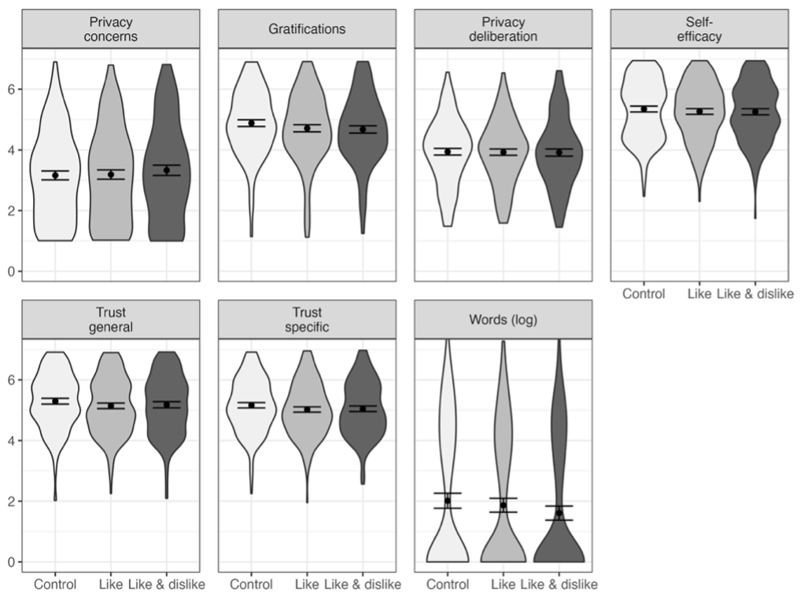

This manuscript features a companion website, which includes the data, research ma-terials, analysis scripts, and a reproducible version of this manuscript (see Link). The hy-potheses, sample size, research materials, analyses, and exclusion criteria were preregistered (see Link). In some cases, the preregistered approach had to be changed. We present the updated methods, using standard regressions models as well as Bayesian hurdle models, in the main text of this paper.
As preregistered, all hypotheses and research questions were initially tested using structural equation modeling with latent variables. The influence of the three websites was analyzed using contrast coding. Because the assumption of multivariate normality was vio-lated, we estimated the models using robust maximum likelihood (Kline, 2016). As recom-mended by Kline (2016), we report the model’s, RMSEA (90% CI), CFI, and SRMR to as-sess global fit. To exclude confounding influences, we controlled all variables for age, gender, and education, which have been shown to affect both privacy concerns and online communi-cation (Masur, 2023; Tifferet, 2019). The preregistered hypotheses were tested with a one-sided significance level of 5%; the research questions were tested with a two-sided 5% signifi-cance level using family-wise Bonferroni-Holm correction.
The structural equation model with multiple predictors fit the data okay, χ2(387) = 934.98, p < .001, cfi = .94, rmsea = .05, 90% CI [.05, .05], srmr = .05. With regard to H1, privacy concerns did not significantly predict communication (β = -.01, b = -0.01, 95% CI [-0.30, 0.28], z = -0.07, p = .473; one-sided). Regarding H2, results showed that gratifica-tions did not predict communication (β = -.02, b = -0.04, 95% CI [-0.19, 0.12], z = -0.45, p = .327; one-sided). RQ1 similarly revealed that privacy deliberation did not predict commu-nication (β = -.10, b = -0.16, 95% CI [-0.35, 0.02], z = -1.76, p = .078; two-sided). Re-garding H3, however, we found that experiencing self-efficacy predicted communication sub-stantially (β = .37, b = 0.77, 95% CI [0.49, 1.05], z = 5.42, p < .001; one-sided). Concern-ing H4, results showed that trust was not associated with communication (β = -.03, b = -0.09, 95% CI [-0.56, 0.38], z = -0.36, p = .358; one-sided).
However, these results should be treated with caution. First, communication was not normally distributed (i.e., zero-inflated and gamma distributed). Although it is possible to analyze non-normal data with structural equation modeling, it is recommended to use anal-yses that model the variables’ distribution, which can be achieved with Bayesian hurdle models (McElreath 2016). The (unstandardized) Bayesian hurdle regression models, modeling the outcome as a zero-inflated gamma distribution using default (flat) priors (chains = 4, iterations = 2,000, warm-up = 1,000, Bürkner, 2017) are reported in the main text. 
Second, in the preregistered analyses several variables were combined that are theo-retically and empirically closely related, leading to multicollinearity (Vanhove 2021). We found several signs of multicollinearity among the predictors, evidenced by the large stand-ard errors or “wrong” and reversed signs of predictors (Vanhove, 2021). For example, in the bivariate analysis trust had a positive relation with communication, whereas in the multiple regression the effect was negative—which should make us skeptical. In predicting communi-cation, we opted for general trust over specific trust, as it exhibited lower levels of empirical and theoretical overlap with gratifications. The updated analyses provided in the main text show these different results. As a remedy, we adopted a causal modeling perspective, control-ling only for confounders—in this case, age, gender, and education—but not for mediators (Rohrer, 2018). For more information on the fitted models, see online companion website.

```{r}
#| label: fig-distributions-prereg
#| echo: false
#| fig-cap: "Figure A1. Distributions and means with 95% CIs of the model-predicted values for each variable, separated for the three websites. Control: Website without buttons. Like: Web-site with like buttons. Like & Dislike: Website with like and dislike buttons. Values from pre-registered SEM."


```


Finally, we analyzed the effects of the popularity cues. It was for example expected that websites with like buttons would lead to more communication, more gratifications, more privacy deliberation, and less privacy concerns. The results showed that the popularity cues had no effects on communication and on the privacy calculus variables. For an illustra-tion, see Figure A1. For the detailed results of the specific inference tests using contrasts, see companion website.


